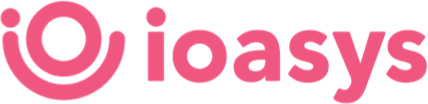

<div align="center">
  
  <h2 align="center">
    Empresas Web | ioasys
  </h2>
</div>

<br />

<div margin="10px 0" align="center">
    
    
    
</div>

## 💎 About

The <b>Empresas Web</b> project is related to a test proposal to join on ioasys development team. The project was developed using React.js together best coding practices, from source code, like large reuse structure, clean code valuation and easily readable code, to best frontend-specific pratices, like theming, consistency, UX improvements.

The source code is covered with jest unit and integration testing, using events and mocking strategies.

The application client is hosted on a surge server that can be viewed on <a href='http://ioasys-enterprises.surge.sh'>http://ioasys-enterprises.surge.sh</a>

## 💻 Installing

To run the application locally, you'll need follow the steps

Clone `gstcarv/empresas-web/` project

```bash
$ git clone https://gstcarv@bitbucket.org/gstcarv/empresas-web.git
```

Navigate to `empresas-web-client` folder

```bash
$ cd empresas-web-client
```

Install the dependencies

```bash
$ yarn install

or

$ npm install
```

## 🚀 Running

Run the project using bash

```bash
$ yarn start

or

$ npm start
```

The application will work on `localhost:3000`

## 🧪 Testing

To run test, you can use the test script

```bash
$ yarn test

or

$ npm test
```

## 💙 Thanks

Made with ❤️ by Gustavo Carvalho to ioasys


